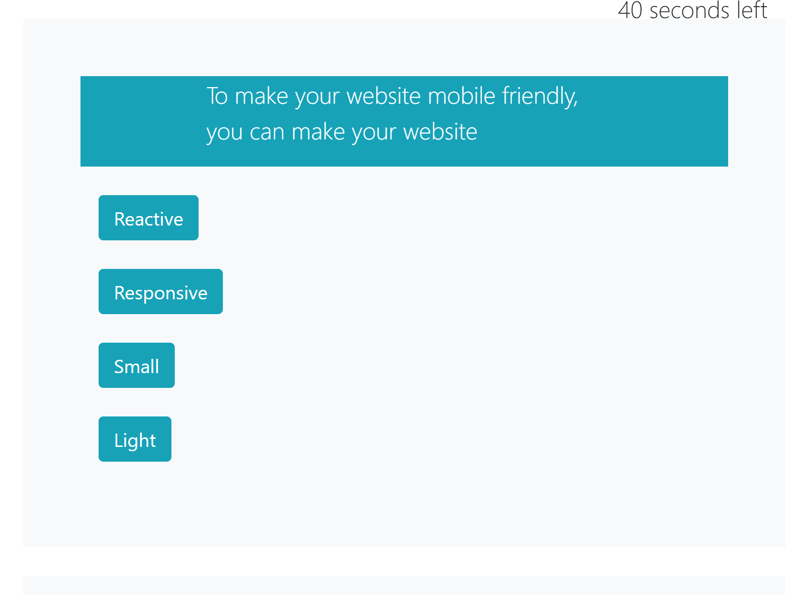
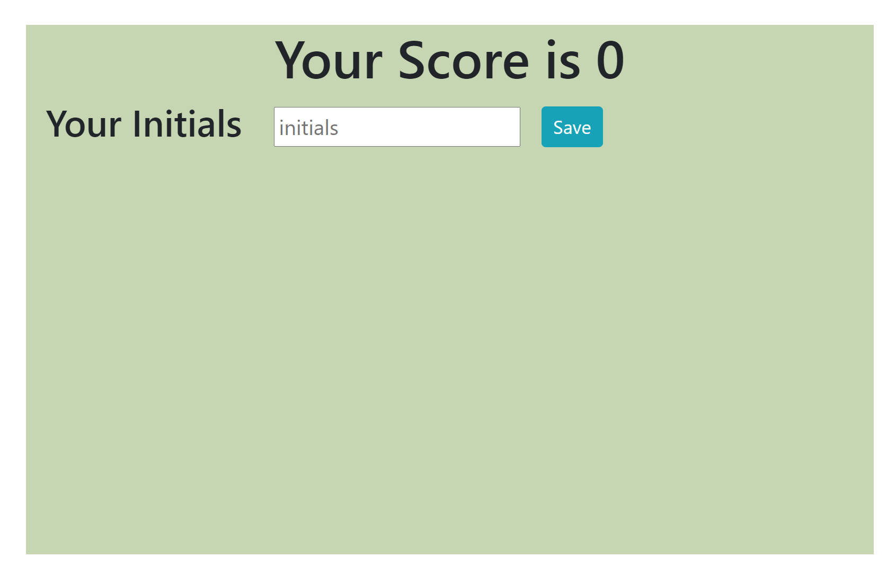
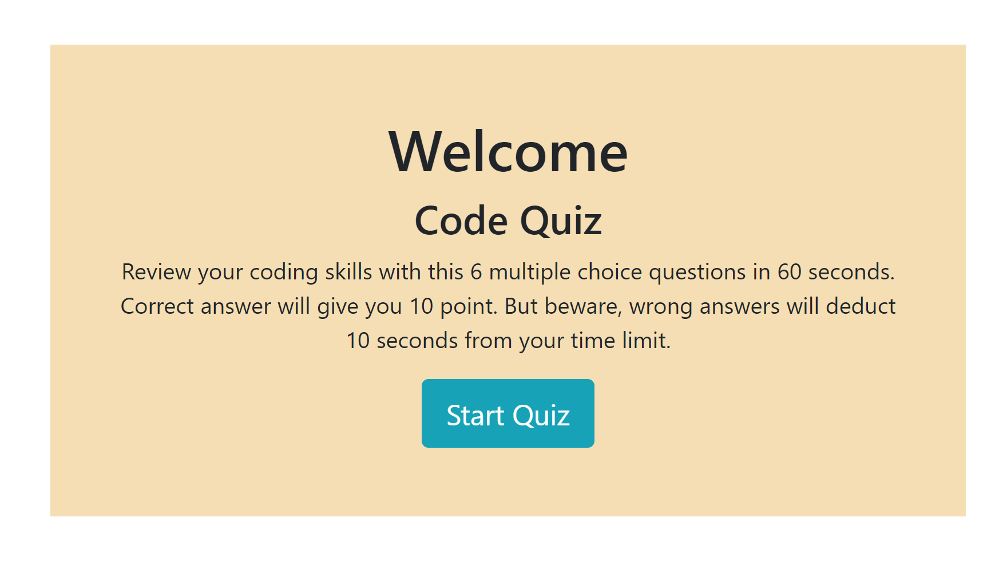

# CodeQuiz-Game
Explore the [project-page](https://github.com/Mgithub89/CodeQuiz-Game.git)

View the [deployed-app](https://mgithub89.github.io/CodeQuiz-Game/)

### Table of contents
   * [About The project](#About-The-Project)
   * [Acceptance Criteria](#Acceptance-Criteria)
   * [ScreenShot](#ScreenShot)
   * [Built With](#Built-With)
   * [Contact](#Contact)

<<<<<<< HEAD
  ### About The Project.
    The main goal of this project is to build a timed coding quiz application with multiple questions that stores user initials and score in the local storage using java script concept based on user story and acceptance criteria.
    This App helps any developer to become familiar with completing a coding assesement as they proceed in the journey to become a web-developer.

### Acceptance Criteria.
GIVEN I am taking a code quiz\
WHEN I click the start button\
THEN a timer starts and I am presented with a question\
WHEN I answer a question\
THEN I am presented with another question\
WHEN I answer a question incorrectly\
THEN time is subtracted from the clock\
WHEN all questions are answered or the timer reaches 0\
THEN the game is over\
WHEN the game is over\
THEN I can save my initials and score.\

## ScreenShoot.

=======
   ## About The Project.
   The main goal of this project is to build a timed coding quiz application with multiple questions that stores user initials and score in the local storage using java           script concept based on user story and acceptance criteria.
    This App helps any developer to become familiar with completing a coding assesement as they proceed in the journey to become a web-developer.

 ## Acceptance Criteria.
GIVEN I am taking a code quiz
WHEN I click the start button
THEN a timer starts and I am presented with a question
WHEN I answer a question
THEN I am presented with another question
WHEN I answer a question incorrectly
THEN time is subtracted from the clock
WHEN all questions are answered or the timer reaches 0
THEN the game is over
WHEN the game is over
THEN I can save my initials and score.

## ScreenShoot.
* Home page

* Question page

* Score page

>>>>>>> 1428eba0c297258d4e6ad5d56d71abb589ca9dd5

## Built with 
* Java Script
* Html
* css

## Contact
Metages Worku - [metages09@gmail.com](mailto:metages09@gmail.com)

